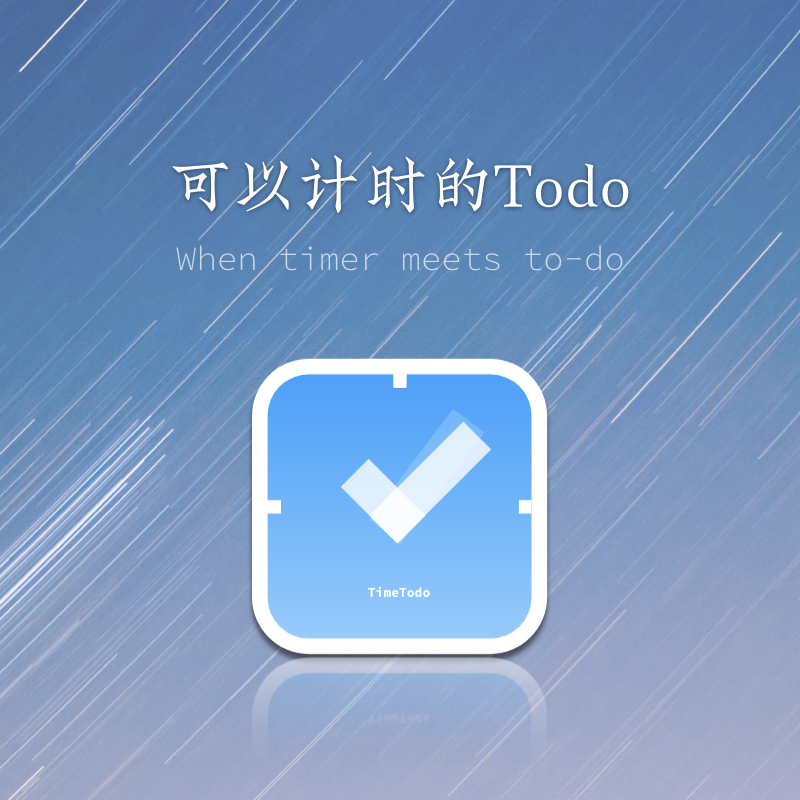
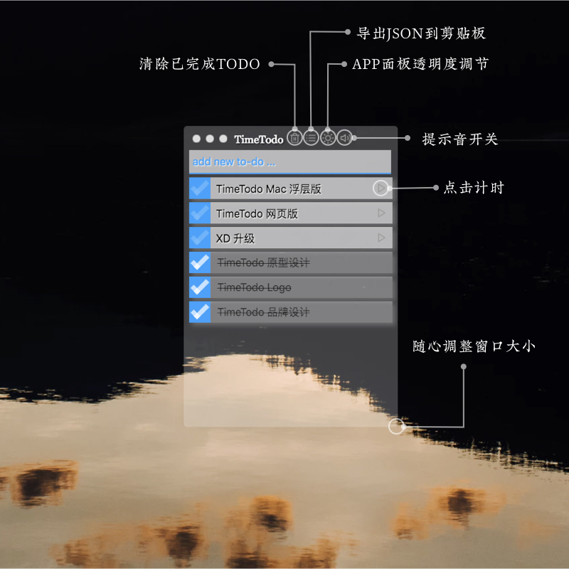

# TimeTodo 



TimeTodo 是一个浮层式的半透明 Todo 应用。除此之外，点击每个 Todo 项后的箭头，可以开始计时。



从 1.0 版本开始 TimeTodo 开始允许用户在添加 Todo 的输入框输入以冒号开头的命令，并以此触发 Web hook 想特定的 URL post Todo数据，并根据其返回值，执行 JS 命令或者 Electron 的命令。此功能极大的提升了 TimeTodo 的可定制性。使其可以用来：

- 读取其他网站的数据并添加为 TODO
- 生成随机密码并复制到剪贴板
- 通过命令设置面板背景和浮动
- 快捷查找PHP 函数
- 以及其他 JS 命令和 Electron 命令可以完成的任务。

## 安装使用

[视频说明](https://www.bilibili.com/video/av37635866/)

以下为 Mac 版说明

⚠️ 1.0使用的存储和之前不同，请预先备份Todo内容。

[客户端独立下载地址](https://github.com/easychen/timetodo-server/raw/master/TimeTodo.v1.1.Mac.zip)

### 客户端安装

1. git clone 或者直接下载 Zip 包解压
2. 将 TimeTodo.***.zip 的包解压，将其中的 TimeTodo.app 复制或者移动到 Application 目录
3. 从 Application 或者启动面板中点击 TimeTodo 图标启动应用

这时候可以正常使用 Todo 的待办事项、计时等相关功能。

高级功能如下：

1. 将电脑上的图片拖拽到Todo添加输入框（ 显示 `add new to-do or command` 处 ），可以为 TimeTodo 设置背景
2. 在Todo添加输入框输入 `:clean` 并回车可以将背景清空
3. 在Todo添加输入框输入 `:close` 并回车可以退出应用

### Web hook 相关功能

### WebHook 测试

⚠️ webhook 会向 hook 地址发送 Todo 数据和剪贴板数据，并执行返回的脚本，所以请务必自行架设。以下地址只供测试，测试完成后请及时更换。

1. 在Todo添加输入框输入 `:webhook=https://timetodo.applinzi.com/` 并回车，可以设置 web hook
2. 输入 `:who` 可以测试是否 work 。提示 It's me 为可以正常工作
3. 输入 `:find sort` 会打开php手册 sort 函数页面

这个时候 TimeTodo 设置的官方提供的 web hook 服务端，只是用于演示，你需要来部署一个自己的服务端。

⚠️ 以下功能需要有 Web 服务器以及 PHP（或者其他语言的） 开发经验。


### 服务端部署


1. 修改 index.php 将其中 `$APIKEY = null; ` 修改为 `$APIKEY = "yourkey"; ` 以提升安全性
2. 将 `index.php` 和 `_lp.php` 上传到可以访问的 Web 服务器，我们假设其公网可访问链接为 `http://somesite.com/`
3. 在Todo添加输入框输入 `:webhook=https://somesite.com/?key=yourkey` 并回车以设置 web hook
4. 再次输入 `:who` 可以测试是否 work 。提示 It's me 为可以正常工作

#### 修改和添加命令

TimeTodo 客户端在用户输入的 Todo 内容以冒号开头时，会查找本地内置的命令，当命令不存在时，会检查是否设置过 web hook。
如果发现存在 web hook，则会向该 URL POST 两个变量 ， cmd 为用户输入的命令、todos 为 TimeTodo 客户端 Todo 列表的 Json 数组。

同时，TimeTodo 客户端会检查该 URL 的返回值。其格式为

```json
{
    code:"0",
    js:"",
    cmd:""
}
```
其中 code 为 0 表示正常；js 为希望 TimeTodo 客户端执行的 JS 命令、cmd 为希望 TimeTodo 客户端执行的 Electron 命令。

在此基础上，我们可以根据场景进行编程。以下为示范代码：

```php

$ret = [];
$ret['code'] = 0;
$ret['js'] = ''; // 页面 js
$ret['cmd'] = ''; // eletron 命令

$cmd = t(v('cmd')); // TimeTodo 上的命令，包含冒号

// 根据命令来修改返回值相关数据
switch( $cmd )
{
    // 直接返回JS命令
    case ':who':
        $ret['js'] = "alert('It\' me 🤠 ')";
        break;

    // 分析 TODO （会 POST 到 $_REQUEST['todos'] 里边 ）
    // 并返回数据
    case ':howmany':
        $todos = json_decode( v('todos') , true );
        $ret['js'] = "alert('你总共有" . count( $todos ) . "个TODO')"; 
        break; 
    
    // 对 TODO 数据进行操作
    // 数据对象为 this.props.store
    // 方法包括：
    // 添加 todo_add( text )
    // 完成 todo_check( id ) // id 可以分析 $_POST['todos'] 取到
    // 未完成 todo_uncheck( id ) 
    // 开始计时 todo_play( id ) 
    // 清除已经完成的TODO todo_clean()
    case ':add':
        $ret['js'] = "this.props.store.todo_add('remote one')"; 
        break;

    // JS 直接操作剪贴板
    case ':rand':
        $ret['js'] = 'window.require("electron").clipboard.writeText("'.uniqid().'");alert("随机密码已复制到剪贴板")';  
        break; 
    
    // 设置面板背景    
    case ':bg':
        $ret['js'] = 'document.querySelector("html").style.backgroundImage = "url(\'https://ws1.sinaimg.cn/large/40dfde6fly1fxy3his1hsj20jq0rsk0q.jpg\')";';  
        break;
    
    // 提示音
    case ':beep':
        $ret['js'] = 'window.require("electron").shell.beep()'; 
        break;

    // 取消顶层浮动
    case ':nofloat':
        $ret['cmd'] = 'win.setAlwaysOnTop(false, "normal", 0);'; 
        break; 
    
    // 开启顶层浮动
    case ':float':
        $ret['cmd'] = 'win.setAlwaysOnTop(true, "floating", 1);'; 
        break;     
    
    // 运行 electron 命令，支持所有的命令
    case ':quit':
        $ret['cmd'] = "app.quit()"; 
        break; 
    
    default:
        // 正则演示 find sort 搜索 PHP 手册
        if( preg_match("/:find\s(.+?)$/i" , $cmd , $out ) )
        {
            $ret['js'] = 'window.require("electron").shell.openExternal("http://www.php.net/manual-lookup.php?pattern=' . $out[1] . '");';
        }
        else
        {
            $ret['js'] = 'alert("输入的命令是' . $cmd . '")';
        }
        

}

// $ret['cmd'] = 'app.quit()';

return send_result( $ret );
```
